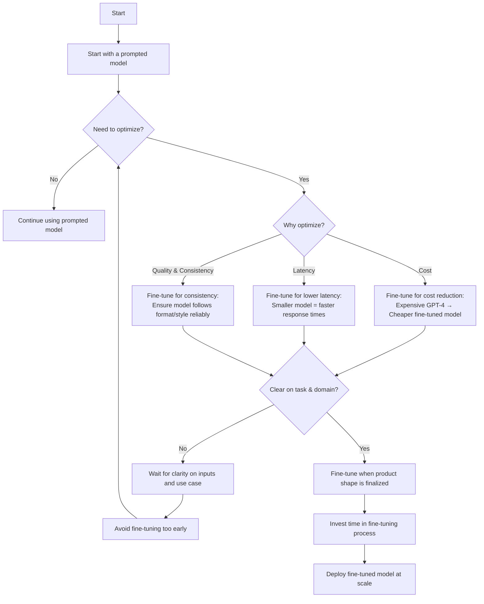

# Introduction to Fine-Tuning Large Language Models

## Slide 1: What is Fine-Tuning?

Fine-tuning is the process of adapting a pre-trained language model to perform specific tasks by training it on additional data.

**Why fine-tune?**
- Customize models for specific use cases
- Improve performance on domain-specific tasks
- Create models that follow your specific instructions

---

## Slide 2: Common Fine-Tuning Methods

### Supervised Fine-Tuning (SFT)
- Train on pairs of instructions and desired responses
- Model learns to generate responses that match the examples
- Simplest and most common approach

### Reinforcement Learning with Human Feedback (RLHF)
- Models learn by receiving feedback on their outputs
- Human evaluations help create a reward signal
- More complex but can produce better results

> **Visual suggestion:** Flow chart comparing SFT (instruction → model → response → compare with example) vs RLHF (instruction → model → response → human feedback → reward signal → improved model)

---

## Slide 3: The Challenge with Fine-Tuning

Large language models have **billions of parameters**:
- Llama 3.1 405B: 243GB
- Llama 3.1 70B: 43GB
- Llama 3.2 11B: 7.9GB

**The problems:**
- Enormous memory requirements
- Long training times
- Expensive hardware needed
- Complex optimization

---

## Slide 4: Parameter-Efficient Fine-Tuning (PEFT)

PEFT methods reduce the number of parameters to update during fine-tuning:

**Benefits:**
- Lower memory usage
- Faster training
- Comparable performance to full fine-tuning
- More affordable

**How it works:**
- Only update a small subset of parameters
- Keep most of the original model frozen

---

## Slide 5: LoRA (Low-Rank Adaptation)

LoRA is one of the most popular PEFT methods.

**How it works:**
1. Instead of modifying the entire weight matrix...
2. Add small "adapter" matrices (A and B)
3. Only train these small adapters
4. Merge with original weights at inference time

**Benefits:**
- Reduces trainable parameters by 10,000× or more
- Maintains model quality
- Adapters are small and swappable

---

## Slide 6: Quantization

Quantization reduces the precision of model weights:

**From:** 32-bit or 16-bit floating point numbers  
**To:** 8-bit or 4-bit integers

**Benefits:**
- Smaller model size (up to 8× smaller)
- Faster inference
- Lower memory usage
- Lower power consumption

---

## Slide 7: QLoRA - Combining Techniques

QLoRA combines quantization with LoRA:

1. Quantize the base model to 4-bit
2. Add trainable LoRA adapters in higher precision
3. Train only the adapters

**Benefits:**
- Fine-tune larger models on consumer hardware
- Run 65B+ parameter models on a single GPU
- Maintain performance quality

---

## Slide 8: Hardware Requirements

**Minimum for QLoRA fine-tuning:**
- Consumer GPU with 24GB VRAM (like RTX 4090)
- 32GB+ system RAM
- SSD with 100GB+ free space

**For larger models:**
- Multiple GPUs or cloud options

---

## Slide 9: Popular Fine-Tuning Tools

**Beginner-friendly options:**
- AutoTrain by Hugging Face
- Unsloth
- Together AI platform

**More advanced options:**
- Axolotl
- LLaMA-Factory

---

## Slide 10: Getting Started

1. **Prepare your dataset**
   - Instruction-response pairs
   - High-quality examples
   - Domain-specific content

2. **Choose your approach**
   - Full fine-tuning (if you have resources)
   - LoRA/QLoRA (recommended for most users)

3. **Select a tool**
   - Based on your technical expertise
   - Based on your hardware

4. **Experiment and iterate**
   - Start small and build up
   - Evaluate results regularly

---

## Resources for Further Learning

- [QLoRA Paper](https://arxiv.org/abs/2305.14314)
- [LoRA Paper](https://arxiv.org/abs/2106.09685)
- [Llama 2 Paper (SFT/RLHF sections)](https://arxiv.org/pdf/2307.09288)
- [Hugging Face Fine-tuning Docs](https://huggingface.co/docs/transformers/training)